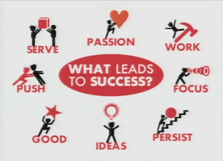

# Home - Lab Guide

## I. Start in Lu Lab

### 🎉 Welcome 

> “_The mediocre teacher tells. The good teacher explains. The superior teacher demonstrates. The great teacher inspires._”  - William A. Ward

* [Lab Introduction](https://cloud.tsinghua.edu.cn/f/b77381dca00844a4890c/)  ( [extension](https://cloud.tsinghua.edu.cn/f/089900d1672548648ab7/) )
* [Lab Manual ](https://docs.qq.com/doc/DWWJzd3l0cllOYkR3) ( [清华校历](https://cn.bing.com/search?q=%09%E6%B8%85%E5%8D%8E%E5%A4%A7%E5%AD%A6+%E6%A0%A1%E5%8E%86+%40tsinghua.edu.cn\&qs=n\&form=QBRE\&sp=-1\&pq=%E6%B8%85%E5%8D%8E%E5%A4%A7%E5%AD%A6+%E6%A0%A1%E5%8E%86+%40tsinghua.edu.cn\&sc=0-24\&sk=\&cvid=64DF6D2C91B94399AD389DB9DF5FCD0C\&ghsh=0\&ghacc=0\&ghpl=)  和 [地图](https://cn.bing.com/search?q=%E6%B8%85%E5%8D%8E%E5%A4%A7%E5%AD%A6+%E5%9C%B0%E5%9B%BE\&go=Search\&qs=ds\&form=QBRE) )
  * See more frequently used info/files @ 腾讯文档: _**Lu Lab - All** _&#x20;
* [Lab Meetings](meeting.md) and [Lab Calendar](cal.md)
* [FAQ](faq.md)

### 📖 Learning 

> "_Tell me and I forget. Teach me and I remember. Involve me and I learn._"  - Benjamin Franklin

* [Courses](https://www.ncrnalab.org/courses) @Tsinghua
  * **\[Basic]** [Bioinformatics Tutorial of Lu Lab](https://lulab2.gitbook.io)
  * **\[Advanced]** [Training Book of Lu Lab ](https://lulab1.gitbook.io/training/)<- organized from lab members' _Experience Sharing (_清华云盘 - Lu Lab Shared/6. Experience Sharing_)_
* [Tips for Literature Reading](literature-reading/reading.md)
  * [More Tips for Research](https://www.yinxiang.com/everhub/personal/336255) @_everhub_ &#x20;
* [PPT Templates](https://cloud.tsinghua.edu.cn/d/9494905887fe45dca6ea/)

## II. Research in Lu Lab

> “_I cannot teach anybody anything; I can only make them think._" - Socrates

> * [腾讯文档](https://docs.qq.com) (private)  ： Lu Lab - All; Lu Lab - Wetlab; Lu Lab - Metadata
> * [清华云盘](https://cloud.tsinghua.edu.cn) (private) : Lu Lab Shared - R and RW; Lu Lab Public Files; Lu Lab Public Photos

### 📊Drylab

* **Hardware** (Facilities and Servers) Instructions @_腾讯文档(private)/Lu Lab - All/intranet_
* **Software** (notes and code)shared by lab members @_腾讯文档(private)/Lu Lab - All/intranet_
* **MetaData** @_腾讯文档(private)/Lu Lab - Metadata_

### 🧪Wetlab

* **Wetlab Instructions, Protocols & Samples** @_腾讯文档(private)/Lu Lab - Wetlab_

## III. Publish in Lu Lab

> "_What sculpture is to a block of marble, education is to a human soul._"  - Joseph Addison
>
> “_The carving and chipping away to create a masterpiece take years of dedication. Teachers help students discover their interests, passions, and ultimately themselves._”

* [Software](http://www.ncrnalab.org/software)
* [Patent](https://www.ncrnalab.org/open/#%E7%9B%B8%E5%85%B3%E4%B8%93%E5%88%A9)
* [Paper](https://www.ncrnalab.org/publications/)
  * 历届毕业论文: 清华云盘 - Lu Lab Shared/4.Thesis
  * Manuscripts: 清华云盘 - Lu Lab Shared/5.Manuscript
    * [Tips for manuscript writing](paper-writing/writing.md)

##

> * **Lu Lab @ Tsinghua University**
> * Address:   School of Life Sciences, Tsinghua University, Beijing, China
> * E-mail:    lulab1 AT tsinghua.edu.cn
> * Homepage:   [www.ncRNAlab.org](http://www.ncrnalab.org)  ( [lulab.life.tsinghua.edu.cn](http://lulab.life.tsinghua.edu.cn) )
> * Software:  [software.ncRNAlab.org](http://software.ncrnalab.org)
> * Courses:  [courses.ncRNAlab.org](http://www.ncrnalab.org/courses)
> * Books: [book.ncRNAlab.org](https://book.ncrnalab.org) (Bioinformatics Tutorial)
> * Docs: [docs.ncRNAlab.org](https://docs.ncrnalab.org)  ( [lulab.gitbook.io](http://lulab.gitbook.io)  |  [lulab.github.io](http://lulab.github.io) )

> [Markdown Syntax](https://github.com/adam-p/markdown-here/wiki/Markdown-Cheatsheet) | [Excel Table to Markdown](https://www.tablesgenerator.com/markdown\_tables) | [Paste to Markdown](https://euangoddard.github.io/clipboard2markdown/)
