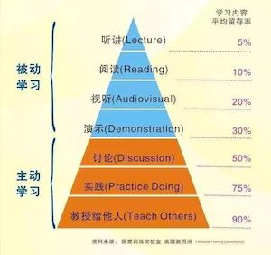

# FAQ

## I) 科研方式

### 科研中建议养成哪些好的习惯？ 

> "_What sculpture is to a block of marble, education is to a human soul._"  - Joseph Addison
>
> “_The carving and chipping away to create a masterpiece **take years of dedication**._&#x20;
>
> _Teachers help students discover their interests, passions, and ultimately themselves._”

1. <mark style="color:orange;">多用 email 少用微信</mark>   （see [detail](faq.md#email))
2. <mark style="color:orange;">做事要提前</mark>（比如请假、比如完成任务）   (see [detail](faq.md#vacation))
3. <mark style="color:orange;">"研究“ > "学习“</mark> -  [_Want to Get Great at Something - Get a Coach_](faq.md#coach)     (see [detail](faq.md#sci) )
4. <mark style="color:orange;">带上纸和笔</mark>
5. [_Think Different_](https://www.bilibili.com/video/BV1oW4y1i7qf/)



### 正式参与生物信息科研课题之前该做哪些准备？ 

\
我们准备了一些可以参考和自学的材料，希望对大家有所帮助，为之后做科研实习甚至读博打好基础。

> 尤其是想做纯drylab课题的同学，建议完成下面的几件事之后再开始正式的科研实习课题。

\
**0. 预修课程准备**

* 基本数学课程： 如《微积分》和《线性代数》
* 基本统计课程： 如《概率论》或《生物统计》
* 基本计算机课程：如《Linux》、《R》、《Python》等
* 基本生物课程： 如《普通生物学》《遗传学》或《分子生物学》
* 机器学习课程：如《机器学习》或《深度学习》
* 生物信息课程： 如《[生物信息学](https://www.ncrnalab.org/courses/#bioinfo)》（本科生课-春季学期），《[生物信息学实践](https://www.ncrnalab.org/courses/#bioinfo2)》（研究生课-秋季学期）

**(1) 完成该链接下的2个性格和能力测试题并email 给我一下结果：**\
[https://cloud.tsinghua.edu.cn/d/cf493b8da3ac409ba2ee/](https://cloud.tsinghua.edu.cn/d/cf493b8da3ac409ba2ee/)\
\
**(2) 文献阅读**\
通过文献阅读了解我们实验室的研究方向，根据自己的基础和爱好，可以参阅 [Literature Reading - Startup](https://cloud.tsinghua.edu.cn/d/07d2b19d6b284ebea5ea/?p=%2F0.%20Startup\&mode=list)\
此外，更多的文献我整理放在了：[Tips for paper reading](literature-reading/reading.md)\
\
**(3) Document your work** &#x20;

建议学会使用github和markdown语言，可以自己注册一个github账号，通过google等工具自己学习利用markdown语言，甚至可以利用github page构建一个自己的网页。\
关于github和markdown，我们有一个简单的介绍：[Getting Started - Bioinformatics Tutorial](https://book.ncrnalab.org/teaching/getting-started)\
\
**(4) 生物信息学的基本技能的学习**

具体可以参考我们的生物信息学教材：（ [https://bioinfo.gitbook.io/](https://bioinfo.gitbook.io/)）。

该教材主要用于我给大家开的《[生物信息学](https://www.ncrnalab.org/courses/#bioinfo)》（本科生课-春季学期）和《[生物信息学实践](https://www.ncrnalab.org/courses/#bioinfo2)》（研究生课-秋季学期），这两门课内容很相似，选修一门即可。

* 注意熟悉三个计算机技能：Linux, R, Python &#x20;
* 有余力的话，还可以提前学习上述教材的PART I, II和III（不着急的话可以等入学后选修这门课）
* 还可以根据自己的基础学习教材里面推荐的一些其他参考内容（[Appendix I. Keep Learning - Bioinformatics Tutorial](https://book.ncrnalab.org/teaching/appendix/appendix1.keep-learning)）

### 如何学习新知识和新技能？ 


Want to get great at something? [**Get a coach**](https://www.ted.com/talks/atul\_gawande\_want\_to\_get\_great\_at\_something\_get\_a\_coach) **!**




听、读、视听、演示都属于**被动的学习**；讨论、实践、教授别人是**主动学习**。 其中教授给他人留存率最高，达到90%。 这一步是费曼学习法的精髓，也就是“以教促学”。所以senior students mentor junior students不仅是一种团队合作和领导力的培养，也是对自己知识的巩固。

### 如何成为一个好的研究生和科研工作者？ 

> "_Tell me and I forget. Teach me and I remember. Involve me and I learn._"  - Benjamin Franklin
>
> **做好从本科生到研究生的角色转变，不能只知道“**<mark style="color:red;">**学习**</mark>**”，要侧重“**<mark style="color:red;">**研究**</mark>**”。**

* **科研生涯的四戒律**&#x20;
  * 1\. 边干边学，不要彷徨；&#x20;
  * 2\. 勇于创新，敢于挑战；&#x20;
  * 3\. 忍受寂寞，注重过程；&#x20;
  * 4\. 掌握历史，树立信心。
* **十准则**&#x20;
  * 1\. Craft good questions&#x20;
  * 2\. Ask for help&#x20;
  * 3\. Respect and appreciate your lab mates&#x20;
  * 4\. Have at least two projects&#x20;
  * 5\. Sleep on it&#x20;
  * 6\. If you need guidance from your mentor, set up a meeting&#x20;
  * 7\. Learn when to be obsessive&#x20;
  * 8\. Start with the task you are least excited about, and do it right away&#x20;
  * 9\. Balance bouts of focused work with short breaks&#x20;
  * 10\. Get organized
* **耶鲁大学的心态理念（对于心态方面的七个建议）** （视频链接： [优酷](https://v.youku.com/v\_show/id\_XNDMwNjc0ODg2MA==.html) | [腾讯](https://v.qq.com/x/page/o075327nzri.html) | [抖音@清华云](https://cloud.tsinghua.edu.cn/d/c93050a161224507a27e/files/?p=%2F%E8%80%B6%E9%B2%81%E5%A4%A7%E5%AD%A6%E7%9A%84%E5%BF%83%E6%80%81%E7%90%86%E5%BF%B5.mp4)）&#x20;
  * 1\. 要无条件自信，即使在做错的时候；&#x20;
  * 2\. 不要想太多，定时清除消极思想；&#x20;
  * 3\. 学会忘记痛苦，为阳光记忆腾出空间；&#x20;
  * 4\. 敢于尝试，不怕丢脸；&#x20;
  * 5\. 每天都是新的，烦恼痛苦不过夜；&#x20;
  * 6\. 面对别人的优秀，发自内心赞美；&#x20;
  * 7\. 做人最高境界不是一味低调，也不是一味张扬，而是始终如一的不卑不亢
* See More
  * [科研生涯的四戒律和十准则](https://www.yinxiang.com/everhub/note/22f83fbc-edd2-41f1-aaa7-3564c572e3ac)
  * [好导师的 16 个标准](https://www.yinxiang.com/everhub/note/1883503d-9b17-4e92-b79e-3084ba7729a0)
  * [如何成为导师眼中的好学生？如何成为学生眼中的好导师？](https://www.yinxiang.com/everhub/note/1e8fbba0-a985-465f-8bce-186d8ec37ff0)

### 导师、同学、同事之间如何交流科研课题的进展？ 

> “_I cannot teach anybody anything; I can only make them think._" - Socrates

**基本原则**： 导师对学生的时间应当尊重，不应当随性就微信索要实验结果或者分析结果；同样的，学生也应当尊重导师和其他同事的时间，有事情要讨论尽量提前预约。因此，除非紧急的事情，email 交流工作会给彼此更多的空间和时间，大家的课题讨论和会议等交流方式也应当结构化。

* **Group Meeting:** sharing and talk practicing
* **Subgroup Meeting**: research results' report & discussion
* **WECHAT** (**urgent**: need answer **within 24 hours or less**)
* **EMAIL** (not urgent, need answer in a day or more)

> **“为什么国外把邮件(email)当微信一样发？**
>
> 邮件(email)办公最大的好处，是不会期待对方“秒回”，所以收件方有足够的时间去整理信息，有更多的弹性时间，即便周末收到也可以等到周一上班再回。 而且因为邮件“非即时性”的特点，发起邮件对话的一方（通常是老板、或者甲方）会对自己编写的信息更认真，会想清楚自己到底要布置什么任务才会发送， 不会像微信这种“即时性”软件一样，很多是突然兴起 。。。
>
> 所以，客观上邮件(email)是不方便的，但就是这种不方便反而利于劳动者， 这是对劳动者私人空间的尊重， 是对上/下班界限的明晰。”
>
> 李小粥@知乎

## II) 实验室规范

### 如何尽快融入到实验室的科研氛围中？

> "_Study while others are sleeping; work while others are loafing; prepare while others are playing; dream while others are wishing._"  - William A. Ward

要积极了解实验室的几个研究方向，认清自己的兴趣所在；闲暇时间要多和师兄师姐交流他们的科研经验，汲取精华，要多问 （当然很多问题可能GOOGLE更方便更高效）。总结下来就是要做到主动积极，勤学好问。

### 有事没法来实验室需要提前多久请假？ 

* 如非事出突然/特殊因由，请**提前一周**发email给PI（抄送实验室管理员）请假；
* 寒暑假、国庆长假等**提前半个月到1个月**安排好工作交接和假日值班；
* 如果只是短暂离开几个小时，可以不用请假。

### 组会和课题讨论小组会之间的差别是什么？

* 课题讨论小组会的形式随意，主要以讨论结果和细节为目的。 不论本科生还是研究生，做研究主要包括三块，汇报也是这三块：
  * （1）文献调研结论（对一个科学问题或者技术的调研和理解）
  * （2）湿实验结果
  * （3）干实验（数据分析）结果
* 组会报告要正式一些，每周一次，每个同学基本每学期会轮到一次的组会报告，以练习正式报告甚至是答辩报告的能力为目的，可以仿照“答辩ppt”的形式，包括I. Background, II. Method, III. Result, IV. Perspective (Future Plan)几个部分。

> 大家做完报告之后都鼓励ppt上传到清华云这个文件夹下（3a.PPT - Project Presentation），对于同一个课题的同学，实验内部默认background的slides是共享的，做报告的同学可以直接使用之前人做过（包括PI的）一些好的background slides，这样可以不断优化和积累background的slides。
>
> 清华云上还提供了一些正式的presentation的模板：4.Sharing - PPT and Poster Templates; 3.Thesis/优秀答辩ppt。

## III) 生活和财务

### 校园内有哪些餐厅可以用支付宝和微信支付？ 

**餐厅**、**清青系列**可使用微信、支付宝结算：

* **清青系列：**
  * **清青牛拉** （听涛园2层） **- 推荐**
  * **清青永和餐厅** （观畴园（万人食堂）1层）- **推荐**
  * **清青咖啡厅** （观畴园（万人食堂）1层）- **推荐**
  * **清青快餐厅** （清芬园地下1层）**- 推荐**
  * 清青休闲餐厅 （桃李园地下1层）
  * 清青披萨餐厅 （紫荆园地下1层）
* **简约快餐厅**：
  * **玉树园二层** （留学生楼）**- 推荐**
  * 芝兰园 （留学生楼）
  * 简约餐厅（桃李园3层）
  * 水木麦原面包坊
* **桌餐餐厅**：
  * 熙春园
  * 甲所餐厅
  * 观畴园（万人食堂）三层

> 详细信息可以关注 ”清华后勤“ 等微信公众号

### 大家平时用什么方式锻炼身体？

实验室有两个运动小组，其中之一是羽毛球小组，另一个是游泳小组，定期会组织大家一起锻炼。

### 购买科研相关的书籍或者办公用品需要开发票时，需要一般纳税人信息怎么办？

我校的增值税发票开票信息如下：

> * 单位名称：清华大学
> * 纳税人识别号：12100000400000624D
> * 其他（地址、电话、开户行及账号等）：**不要填，一定空着**

## IV) 远程工作

### 需要下载论文或者登录校园网，如何连接清华VPN?

* 方法1. 清华大学WebVPN
* 方法2. SSL VPN

> 更多帮助：[https://its.tsinghua.edu.cn](https://its.tsinghua.edu.cn)

### 如何录制讲课视频？

* 方法一：PPT 自带录音功能 (PPT录制方法：打开PPT—点击“幻灯片放映”—录制幻灯片演示-从头开始录制—录制完选择“文件” — 保存 或者 另存为ppsx格式 或者 导出mp4格式）（ [录制指南链接](https://support.office.com/zh-cn/article/%E5%9C%A8-powerpoint-%E6%BC%94%E7%A4%BA%E6%96%87%E7%A8%BF%E4%B8%AD%E6%B7%BB%E5%8A%A0%E6%88%96%E5%88%A0%E9%99%A4%E9%9F%B3%E9%A2%91-c3b2a9fd-2547-41d9-9182-3dfaa58f1316)  |  [视频教程链接](https://jingyan.baidu.com/article/ce09321b7bf2042bff858f8d.html)）（注：可以直接保存和分享ppt文件，点播放时会自动有声音；如果不想分享源文件，可以存为带配音的＊.pps或＊.ppsx演示文稿，也可通过Powerpoint软件导出mp4（会很慢，注意等待较长时间完成导出））
* 方法二： 在Mac上使用Quicktime录屏, 快捷键： (shift+CMD+5)&#x20;

## V) 办公硬件和软件

### 科研办公中的个人硬件如何购买？

* 找管理员先申请后购买（和置换），需要管理员整体协调好之后报PI审批同意。
* 每年新定导的研究生都会有一个固定金额（咨询管理员）封顶的个人电脑硬件购置费（个人电脑+外围比如显示器、鼠标键盘等）。 一般得等到年底（一般12月份左右）硬件费下来之后再购置。 但是大家如果着急想用新的，也可以每年的618期间自己在京东上先买着（比如可以先买个显示器和鼠标键盘之类的），开好电子发票（发票抬头税号等有严格要求，问一下管理员），等年底经费到了再报销就好。
* **特别提醒**： 在总额度一定的前提下，推荐大家优先将预算用于购买一些对眼睛和人体功能有益的参数和性能。尤其是笔记本电脑的预算要注意：因为笔记本电脑主要用来办公而不是大规模计算（科研相关的计算都是在实验室的大型机器上远程运算），不推荐追求 CPU、GPU 等参数，我们更是反对购买高性能笔记本电脑后让自己沉迷游戏。
* 平常使用中如果意外损坏，可以报管理员维修或者替换新的。 个人硬件使用3年以上的（个人电脑5年以上），可以跟管理员申请购置新的。

### 科研办公中的常用软件如何获取和购买？

* 清华大学购买和提供了很多常用的软件，供校内师生下载和使用，包括 Windows Pro, Office, WPS，ENDNOTE, MATLAB，NOD32，卡巴斯基等。（ [下载地址：清华大学信息化服务平台](https://its.tsinghua.edu.cn) ）
* 如需购买其他特定软件，请向实验室管理员递交申请，写明需要哪种软件，以及版本号等信息。
* 此外，对大多的开源软件，清华也提供一个镜像网站，地址： [清华大学开源软件镜像站](https://mirrors.tuna.tsinghua.edu.cn/)

### **How to automatically receive related literature update every week?**

**see** [**Tips for paper reading - Literature Search**](literature-reading/reading.md#tips-for-literature-search)**.**

## VI) 网络和数据

### 我们要经常备份数据吗？

* **日常的数据备份是必需的**：[How to backup your data？](https://lulab2.gitbook.io/teaching/part-i.-basic-skills/1.setup#3-backup-your-data-regularly)

### 在实验室如何上网？

目前实验室分校园网（外网：166.156.。。。）及内部网（172.22.220….）（每个座位都有标签标明外网、内网），对于校园网上网原则上使用个人帐号。 每间屋子都有无线信号覆盖（接内网），无线名为所在房间，如:lulab2110,密码联系计算机管理员获得。

### How to remove cache of a redirect site?

有些时候实验室的域名更换了host的服务器，但是自己电脑cache里还是存的老服务器地址，造成一些链接没法访问，可以清除自己浏览器的cache，重新刷新一下。

例如，Mac Chrome 可以如下配置：

View --> Developer --> Developer Tools --> Settings (click upright corner)

check "_disable cache_"
