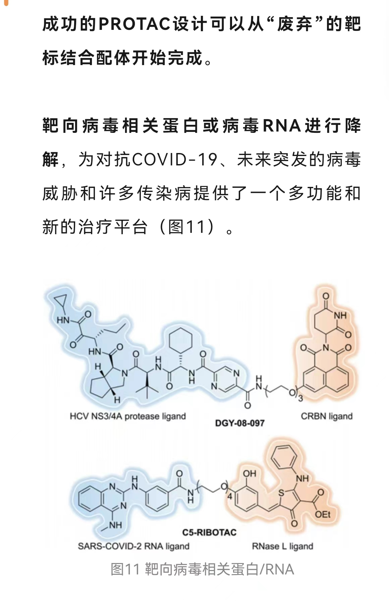

# RNA Target & Drug

> * [**PDFs**](../)
> * ✅ : Recommended

## 0.Reviews

**RNA & noncoding RNA**

* ✅ [_**2021 Nature Reviews | Drug Discovery**_](https://www.nature.com/articles/s41573-021-00219-z) - Noncoding RNA therapeutics — challenges and potential solutions&#x20;
* ✅ [_**2022 Cell Death and Disease**_](https://www.nature.com/articles/s41419-022-05075-2) - RNA-based therapeutics: an overview and prospectus

**Oligos targeting RNA**

* [_**2022 Nature Reviews | Genetics**_](https://www.nature.com/articles/s41576-021-00439-4) - Drug delivery systems for RNA therapeutics
* [**2021 **_**Nature Nanotechnology**_](https://www.nature.com/articles/s41565-021-00898-0) -  The current landscape of nucleic acid therapeutics

**Small molecules targeting RNA**

* ✅ [**2022 Nature Reviews Drug Discovery** ](https://doi.org/10.1038/s41573-022-00521-4)- Targeting RNA structures with small molecules
* [**2021 Nature Reviews Drug Discovery**](https://www.nature.com/articles/s41573-021-00199-0) - Advances in targeting ‘undruggable’ transcription factors with small molecules
* **2020 J. of Med. Chem.** - How We Think about Targeting RNA with Small Molecules
* ✅ **2018 Nature Reviews Drug Discovery** - Principles for targeting RNA with drug-like small molecules
* [以RNA为靶标的小分子药物的研究进展](https://zhuanlan.zhihu.com/p/610068685) - 知乎
* [药物研发的全新领域：靶向RNA，驶向新蓝海](https://mp.weixin.qq.com/s/SApxzr3NFKzH2eBMRK8wdg) - 微信

## I-A. RNA-oligo

* _**2018 BMC Genomics**_, SiRNA silencing efficacy prediction based on a deep architecture&#x20;
* ✅ \[off-target] _**2017 Cell Systems**_ - Explicit Modeling of siRNA-Dependent On- and Off-Target Repression Improves the Interpretation of Screening Results
* [_**Our papers: NAR 2008a, 2008b, 2008c**_](https://www.ncrnalab.org/publications/pub.html#ii-2-sirnashrna-targeting-rna)
* _**2008 Bioinformatics**_, siDRM: an effective and generally applicable online siRNA design tool
* _**2007 NAR**_ - Comparison of approaches for rational siRNA design leading to a new efficient and transparent method
* _**2006 BMC Bioinformatics**_  - Computational models with thermodynamic and composition features improve siRNA design
* _**2006 BMC Bioinformatics**_ - An accurate and interpretable model for siRNA efficacy prediction
* _**2005 Nature Biotech.**_ - Design of a genome-wide siRNA library using an artificial neural network

**sgRNA prediction**

* ✅ _**2018 Nature Biotech.**_ - Deep learning improves prediction of CRISPR–Cpf1 guide RNA activity
* ✅ \[off-target] _**2016 Nature Biotech.**_ -Optimized sgRNA design to maximize activity and minimize off-target effects of CRISPR-Cas9
* [more sgRNA papers](https://portals.broadinstitute.org/gppx/crispick/public/faq)&#x20;

## I-B. RNA-RNA

* [_**2017 Bioinformatics**_](https://www.ncbi.nlm.nih.gov/pmc/articles/PMC5408919/) - A comprehensive benchmark of RNA–RNA interaction prediction tools for all domains of life
* [**2022 **_**Symmetry**_ ](https://www.mdpi.com/2073-8994/14/7/1302)- Recent Deep Learning Methodology Development for RNA–RNA Interaction Prediction
* \[book] [**2023 **_**RNA Structure Prediction**_](https://link.springer.com/protocol/10.1007/978-1-0716-2768-6\_11) - Web Services for RNA-RNA Interaction Prediction

## I-C. RNA-RNA seq

* ✅ **\[review]** [_**2022 Current Opinion in Genetics & Development**_](https://doi.org/10.1016/j.gde.2021.11.007) - Architecture of RNA–RNA interactions
* ✅  **2020 **_**Nature**_ - RIC-seq for global in situ profiling of RNA–RNA spatial interactions.&#x20;
* **2023 Nature** - Complementary Alu sequences mediate enhancer–promoter selectivity

## II. RNA-Protein

#### **Reviews**

* **2018 Nature Reviews** - A brave new world of RNA-binding proteins
* **2018 Mol Cell** - Advances in CLIP Technologies for Studies of Protein-RNA Interactions.pdf
* **2018 Annual Reviews** - Data Science Issues in Studying Protein–RNA Interactions with CLIP Technologies&#x20;

#### **Research**

* ✅ **NMF:** 2017 _Genome Biology_ - Identification of high-confidence RNA regulatory elements by combinatorial classification of RNA–protein binding sites
* ✅ **Deep Learning:** 2015 _Nature Biotech._ - DeepBind: Predicting the sequence specificities of DNA- and RNA-binding proteins by deep learning

## III. RNA-ligand

* [**2022 Nature Biotech.**](https://doi.org/10.1038/s41587-022-01307-0) - Prediction of protein–ligand binding affinity from sequencing data with interpretable machine learning
* **2021 Nature Biotech.** - First small-molecule drug targeting RNA gains momentum
* [**2020 Cell**](https://www.sciencedirect.com/science/article/pii/S0092867420301021#!) - A Deep Learning Approach to Antibiotic Discovery

### 0. Known Examples

* ✅ **Targeting miRNA precursor and mRNA’s UTR:**  Programming inactive RNA-binding small molecules into bioactive degraders, _**Nature**_ 2023
* ✅ **Targeting lncRNA Xist** with compounds that disrupt RNA structure and X inactivation,  _**Nature**_ 2022
* **Targeting mRNA splicing** (SMN2 exon7): A small molecule (SMN-C5) targeting RNA for a specific splicing correction of SMN2 exon7 to treat spinal muscular atrophy,  _**Nature Chem. Biol.**_ 2019
* ✅  **Targeting Ribo-switch**: Selective small-molecule inhibition of an RNA structural element, _**Nature**_ 2015
* **Targeting HIV TAR**: Discovery of selective bioactive small molecules by targeting an RNA dynamic ensemble, [_**Nature Chem. Biol.**_  2011 ](https://www.nature.com/articles/nchembio.596)

### 1. RNA element druggable by ligand

* **2021-Bioinformatics**-Recognition of small molecule–RNA binding sites using RNA sequence and structure
* **2019 Nature Chem. Biol.** - Structural basis of a small molecule targeting RNA for a specific splicing correction
* **2019 Methods in Enzymology** Volume 623 - Differentiation and classification of RNA motifs using small molecule-based pattern recognition
* **2018 Nature Chemical Biology** - Small molecules that target group II introns are potent antifungal agents

#### 1.1 Riboswitch

* ✅  **2017 PNAS -** Bioinformatic analysis of riboswitch structures uncovers variant classes with altered ligand specificity
* [**2014 PNAS**](https://www.pnas.org/cgi/doi/10.1073/pnas.1414678111) - Functional conservation despite structural divergence in ligand-responsive RNA switches

### 2. RNA-ligand interaction

* [**2022 BIB**](https://academic.oup.com/bib/advance-article-abstract/doi/10.1093/bib/bbac486/6832814?redirectedFrom=fulltext) - RLBind: a deep learning method to predict RNA–ligand binding sites
* ✅  **Drug RNA: **_**2020 NAR**_ - Augmented base pairing networks encode RNA-small molecule binding preferences
* ✅  **2020 SLAS Discovery** - Targeting RNA with Small Molecules: Identification of Selective, RNA-Binding Small Molecules Occupying Drug-Like Chemical Space
* **2015 WIREs Comput Mol Sci** - Modeling of ribonucleic acid ligand interactions

### 3. RIBOTAC

* **RIBOTAC** (Ribonuclease Targeting Chimera) and **PROTAC**:&#x20;
  * \[review] PROTAC targeted protein degraders: the past is prologue, _Nature Reviews Drug Discovery_ 2022
  * [**RIBOTAC & PROTAC 介绍**](https://mp.weixin.qq.com/s/zlS33lwnnko1pGOdWq5e6g)

