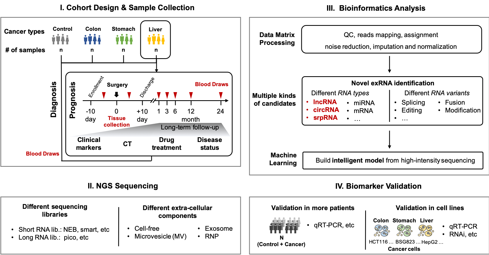

# Wet Lab Training @ 2019

## [FAQ](faq.md)

## Class I. Basics

1. [Safety](../wetlab\_safety.md) &#x20;
2. [Regulation](broken-reference)  &#x20;
3. [Protocols](https://github.com/lulab/intranet/blob/master/wetlab\_protocol/README.md) (Private)
4. [How to design sample cohort](class-1\_basics/4.how-to-design-sample-cohort.md)
5. [How to collect and manage samples](class-1\_basics/5.-how-to-collect-and-manage-samples.md)
6. [How to purify RNA from blood](class-1\_basics/6.-how-to-purify-rna-from-blood.md)
7. [How to check the quantity and quality of RNA](class-1\_basics/7.-how-to-check-the-quantity-and-quality-of-rna.md)
8. [RNA storage](class-1\_basics/8.-rna-storage.md)
9. [How to remove DNA contanimation](class-1\_basics/9.-how-to-remove-dna-contanimation.md)
10. [What is Spike-in](class-1\_basics/10.-what-is-spike-in.md)

## Class II. NGS I

1. [How to do RNA-seq](class-2\_ngs-i/how-to-do-rna-seq.md)
2. [How to check the quantity and quality of RNA-seq library](class-2\_ngs-i/how-to-check-the-quantity-and-quality-of-rna-seq-library.md)
3. [What is Smart-seq2 and Multiplex](class-2\_ngs-i/what-is-smart-seq2-and-multiplex.md)

## Class III. NGS II

* 1\. How to do Pico
* 2\. How to improve Pico
  * 2.1 Replace pico kit by other independent reagents
  * 2.2 Introduce UMI & barcode into pico system
  * 2.3 Remove ribosomal cDNA by DASH/CRISPR method

## Class IV. Validation

* 1\. How to find and select candidates
  * 1.1 Differential Expression
  * 1.2 Alternative Splicing
* 2\. How to find controls and references
* 3\. How to do qRT-PCR
  * 3.1 How to select qPCR strategy
  * 3.2 How to reverse transcrip RNA to cDNA
  * 3.3 How to design qPCR plate
  * 3.4 How to minish qPCR error between replicats
  * 3.5 How to analysis qPCR results
* 4\. How to do ddPCR
* 5\. More validation methods
  * Alternative splicing: Agilent 2100 or gel electrophoresis

## Class V. Patent and License

1. How to design different cohorts
2. How to prepare paperwork
3. How to prepare testing kit

## APPENDIX

1. Common laboratory instruments
2. Frequently-used reagents and consumables

