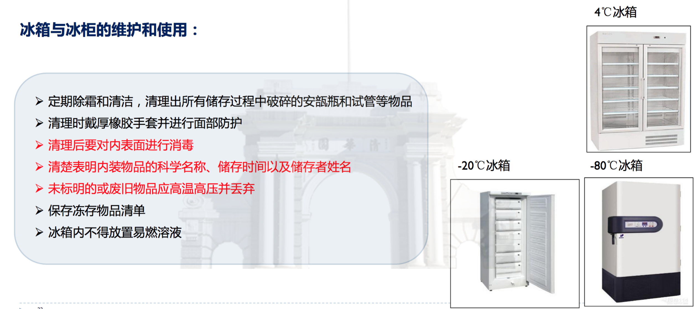
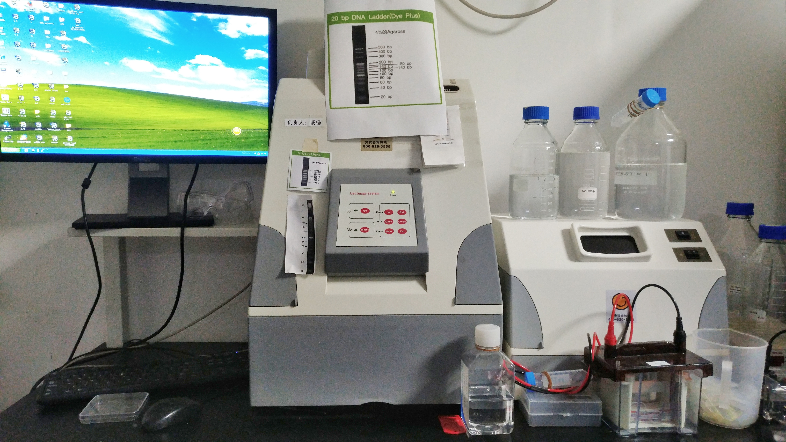
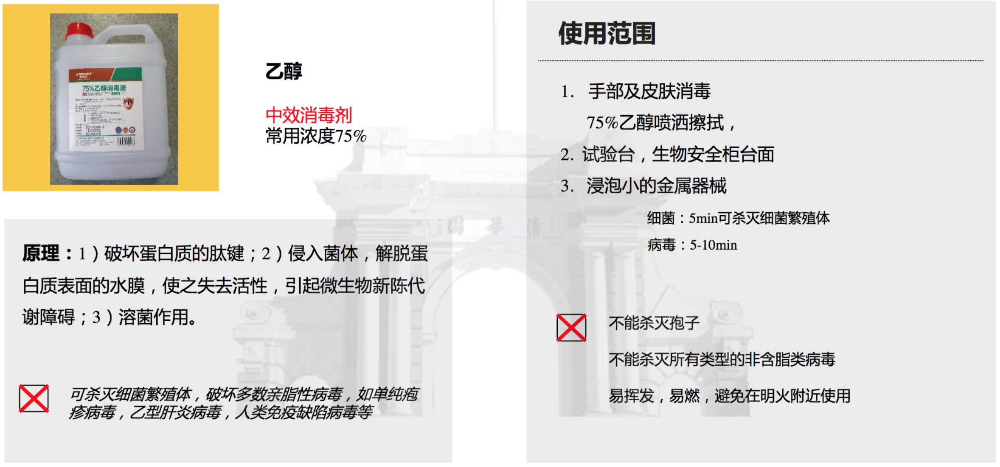
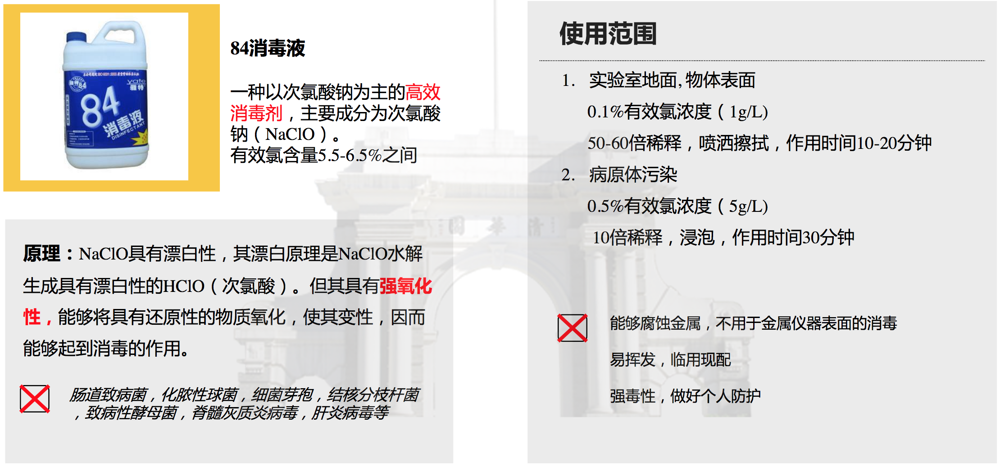
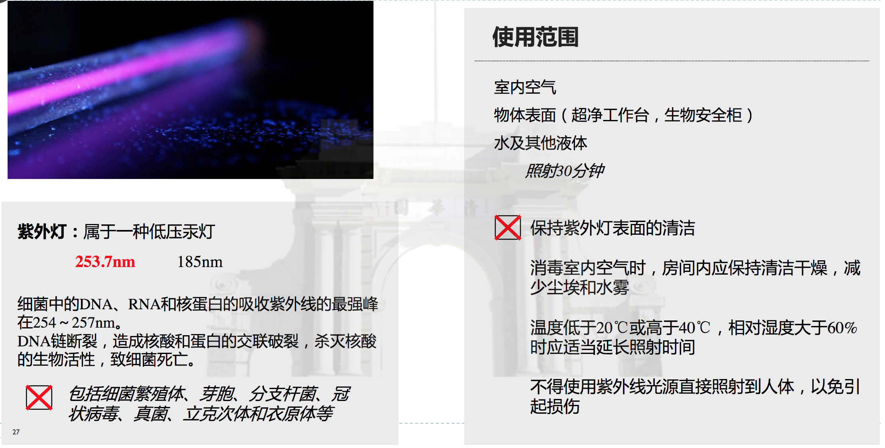
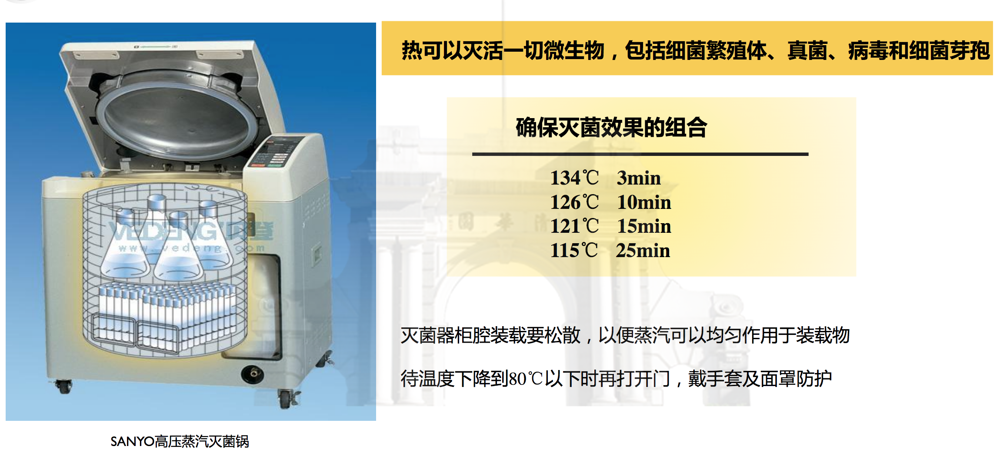
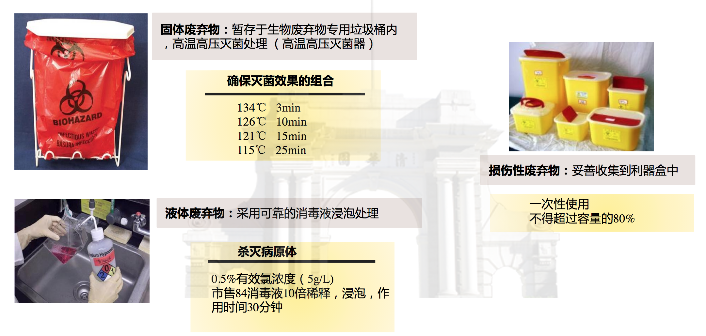
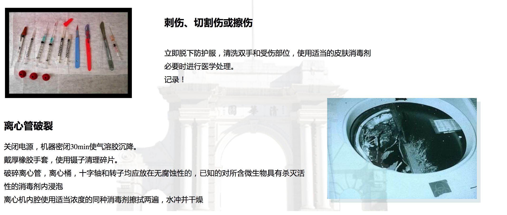

# 1. Wet Lab Safety

## 1. 实验室主要生物样本

目前，实验室涉及到的生物样品主要包括肝癌、结直肠癌、肺癌和胃癌等癌症病人的血浆，以及肝炎、肝硬化病人和正常人的血浆。其中，来自肝炎、肝硬化以及肝癌病人血浆样本的乙型肝炎病毒\(HBV\)是需要我们重点预防的对象。

* 乙肝病毒的传播途径

乙肝病毒通过接触感染者的血液或体液传播，其主要传播途径包括：分娩时的母婴传播，不安全的注射和输血，以及未加保护的性接触。

乙肝病毒并不通过以下渠道传播：共用餐具，母乳喂养，拥抱，接吻，握手，咳嗽，喷嚏，或在公共游泳池玩耍或类似行为。

* 乙型肝炎的预防

接种乙肝疫苗是预防乙肝最安全、有效的措施。全程接种乙肝疫苗后，约80％－95%的人群可产生免疫能力，保护效果可持续20年以上。乙肝疫苗全程免疫需按0，1，6月接种3针。

**由于我们实验室的实验操作涉及肝炎、肝硬化以及肝癌病人的血浆样本，因此参与人员需要对乙肝病毒免疫。如果不清楚自己是否接种过乙肝疫苗，建议去校医院保健科进行血清HBsAg、抗-HBc和抗-HBs检测。如果没有接种过乙肝疫苗或者体内HBV抗体水平低，建议接种乙肝疫苗。**

## 2. 实验室操作规范

**1. 实验室个人防护基本要求**

**2. 生物安全柜使用规范**

**3. 冰箱与冰柜的使用和维护**

 除此之外，从冰箱和冰柜取放样品或试剂，请尽量快速取放，关好冰箱或冰柜的门，避免其温度升高损坏样品和试剂，或者结冰导致抽屉难以拉开。尤其-80℃冰箱，更需特别注意快速取放，及时关好冰箱门。

**4. 实验室污染区**

 实验室污染区主要集中在进行**凝胶电泳和显影的试验台**上（如上图所示），虽然核酸染料Gelsafe具有油性大分子结构，理论上不能穿透细胞膜进入细胞内，但是其仍具有一定的诱变性。所以在此区域操作**请务必做好个人防护**。

**5. 实验室消毒与灭菌**

* 消毒与灭菌

* 75%酒精

* 84消毒液

* 紫外灯

* 高压蒸汽灭菌锅

## 3. 实验室废弃物处理

目前，清华大学生物废弃物处理平台仅处理**固态感染性废物**，不包括：废液、损伤性废弃物（注射器针头、缝合针、手术刀、破碎玻璃制品等）、药物性废弃物（如抗生素、致癌药物、免疫抑制剂等）、病理性废弃物（实验动物组织、器官、尸体、切片等）。生活垃圾一律不准放入生物废弃物垃圾袋中。待处置的生物废弃物应放置于**专用垃圾袋和垃圾桶**中，垃圾袋标签处要填写内容并系好袋口[实验室生物废弃物标签模板](https://drive.google.com/open?id=1RdeAOP8rMCRjqI9EAJlVDHW9J5q-H-zT)。各实验室于**每个工作日上午9:00之前将垃圾袋放置于实验室门口处**，由平台工作人员统一收集。具体请参考[清华大学实验室生物废弃物处理流程](https://drive.google.com/open?id=19l4qcKRHi79zW5Isvg3wWepUe7eqdyqh)。

## 4. 实验室暴露感染与应急处理

## 5. 实验室试剂耗材采购途径

目前，实验室试剂耗材主要在以下两个平台采购：

* [清华大学info系统](http://mass.tsinghua.edu.cn/chem/www/index.php/Loginout/Index/login.html)
* [供应室平台](http://www.gongyingshi.com/index/area-index)

如需购买试剂/耗材，应先与实验室管理员联系，获得购买权限；选定待采购物品后下单，并联系实验室管理员审批。

超过1,000元的试剂/耗材需要事先向实验室负责人（鲁老师）邮件请示，注明试剂名称、用途、价格、详情链接，并抄送实验室管理员，待老师同意后才可购买。

`注意： 试剂/耗材采购均有一定的货期，请计划好实验，提前购买。 实验室每月的值班人应定期检查常用试剂/耗材情况，及时购买与补充。 对于货期较长的试剂，任何人在使用时发现余量不足1/3时，应及时联系值班人或该试剂盒负责人，提前购买，避免影响实验`

## 6. 附件

* [清华大学实验室生物废弃物处理指南](../../wetlab_safety/waste.md)

