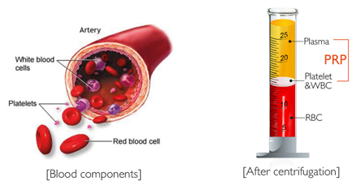
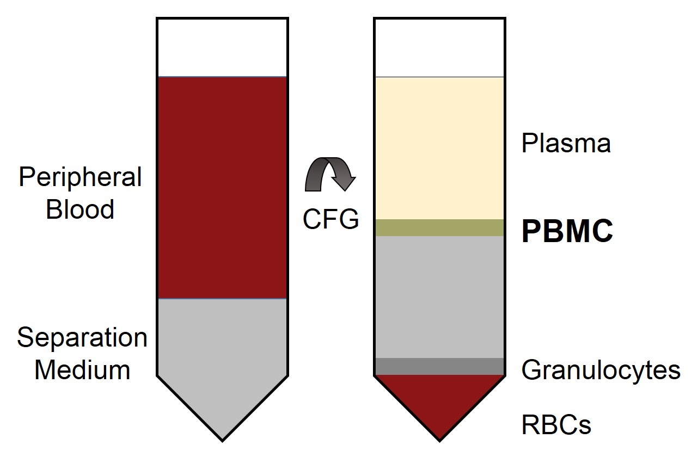
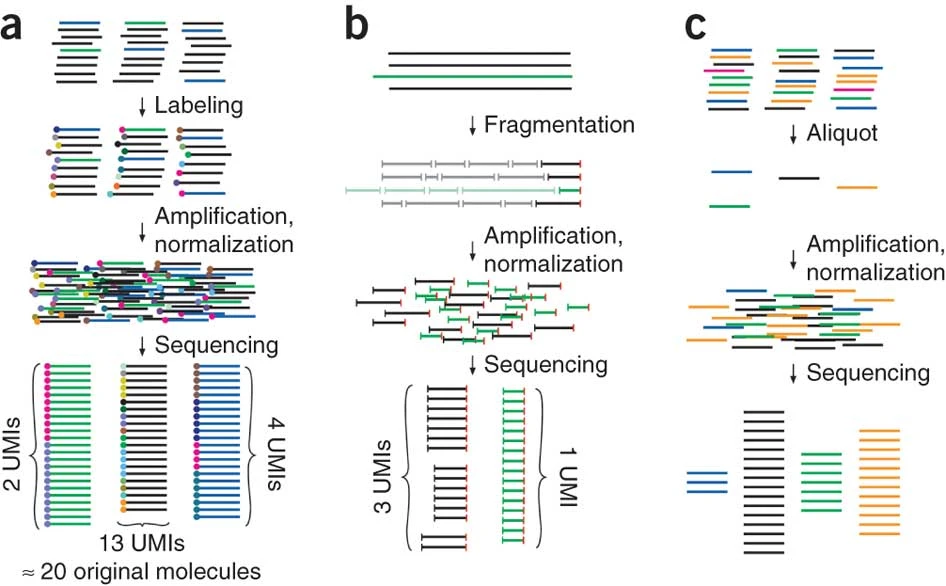

# FAQ

## General

### What is Plasma?

**Answer:** Plasma Make up ~55% of total blood volume.It is the liquid portion of blood that has been prevented from clotting and is more reflective of the blood as it circulates in the body. When blood cells, protein have been removed, plasma is mostly water that is dissolved with proteins, hormones, minerals and carbon dioxide.

### Plasma or Serum?

**Answer:** Both plasma and serum are important parts of blood. The blood comprises of plasma, serum, platelet, white blood cells and red blood cells. The main difference between plasma and serum lies in their clotting factors.

Plasma = Serum + fibrinogen + clotting factors

Read more: [Difference Between Plasma And Serum](http://www.differencebetween.net/science/health/difference-between-plasma-and-serum/#ixzz6Has5TTKh)[Plasma or Serum?](https://www.austincc.edu/mlt/phb/Pulse_serum%20or%20plasma-2.pdf)

### What is Platelet?

**Answer:** **Platelets** are a component of blood whose function is to react to bleeding from blood vessel injury by clumping, thereby initiating a blood clot. Platelets have no cell nucleus: they are fragments of cytoplasm that are derived from the megakaryocytes of the bone marrow, which then enter the circulation.

### What is PBMC?

**Answer:** **Human Peripheral Blood Mononuclear Cells \(PBMCs\)** are blood cells with a single round nucleus. These cells include lymphocytes \(T, B and NK cells\), monocytes and dendritic cells. PBMCs are parts of the immune system which are critical to cell-mediated and humoral immunity. Our Human PBMCs are isolated from normal healthy donor leukopaks collected in acid-citrate-dextrose formula A \(ACDA\) as an anticoagulant. All donors must be tested negative for HBV, HCV and HIV and are IRB consented.

## exRNA: extra-cellular RNA

### How many types of exRNAs?

**Answer:** **exRNA** \(extra-cellular RNA\) includes long and short RNAs, which can be derived from the whole plamsa/serum \(**cf-RNA**: cell -free RNA\), or enriched from the exosomes/EVs of plasma/serum \(**exoRNA**\).

* _Long RNA_ \(&gt;200nt\): mRNA \(RNA coding for protein\), lncRNA \(long noncoding RNA\), rRNA
* _Small noncoding RNA \(ncRNA\)_ \(20-30nt\): miRNA, piRNA, siRNA
* _Ohter noncoding RNA \(ncRNA\)_ \(100-200nt\): tRNA, Y RNA, snRNA, snoRNA, srp RNA, etc

## RNA-seq

### What is barcode and multiplex?

**Answer:** Multiplex sequencing allows large numbers of libraries to be pooled and sequenced simultaneously during a single run on a high-throughput instrument. Sample multiplexing is useful for many applications, from targeted panels to whole human genome sequencing.

Individual "barcode" sequences are added to each DNA fragment during next-generation sequencing \(NGS\) library preparation so that each read can be identified and sorted before the final data analysis. Pooling samples exponentially increases the number of samples analyzed in a single run, without drastically increasing cost or time.

> Multiplex Sequencing Highlights

* _Fast High-Throughput Strategy:_ Large sample numbers can be simultaneously sequenced during a single experiment
* _Cost-Effective Method:_ Sample pooling improves productivity by reducing time and reagent use
* _High-Quality Data:_ Accurate maintenance of read length of unknown sequences
* _Simplified Analysis:_ Automatic sample identification with "barcodes" using Illumina data analysis software

### What is SMARTer?

**Answer:** Switch Mechanism at the 5' End of RNA Templates, which relies on template switching, used for transcriptome analysis from single cells. Smart-Seq was developed as a single-cell sequencing protocol with improved read coverage across transcripts.

Procedure: Cells are lysed, and the RNA is hybridized to an oligo\(dT\)-containing primer. The first strand of the cDNA is synthesized with the addition of a few untemplated C nucleotides. This poly\(C\) overhang is added exclusively to full-length transcripts. An oligonucleotide primer is hybridized to the poly\(C\) overhang and used to synthesize the second strand. Full-length cDNAs are PCR-amplified to obtain nanogram amounts of DNA. The PCR products are purified for sequencing.

There are 2 versions of Smart-Seq: Smart-Seq and Smart-seq2. Smart-seq2 includes several improvements over the original Smart-Seq protocol. The new protocol includes a locked nucleic acid \(LNA\), an increased MgCl2 concentration, betaine, and elimination of the purification step to improve the yield significantly.

> Reference:

* [Picelli, S., Faridani, O. R., Björklund, Å. K., Winberg, G., Sagasser, S., & Sandberg, R. \(2014\). Full-length RNA-seq from single cells using Smart-seq2. Nature protocols, 9\(1\), 171.](https://www.ncbi.nlm.nih.gov/pubmed/24385147/)

### What is TSO?

**Answer:** The TSO \(template switch oligo\) is an oligo that hybridizes to untemplated C nucleotides added by the reverse transcriptase during reverse transcription. The TSO adds a common 5' sequence to full length cDNA that is used for downstream cDNA amplification.

The TSO is used differently in the Single Cell 3' assay compared to the Single Cell 5' assay. In the 3' assay, the polyd\(T\) sequence is part of the gel bead oligo \(which also contains the 10x Barcode, UMI, and partial Illumina Read 1 sequence\), with the TSO supplied in the RT Primer. In the 5' assay, the polyd\(T\) is supplied in the RT Primer, and the TSO is part of the gel bead oligo.

Single Cell 3' assay after reverse transcription:

Single Cell 5' assay after reverse transcription:

Products: Single Cell 3', VDJ

> [Original Page](https://kb.10xgenomics.com/hc/en-us/articles/360001493051-What-is-a-template-switch-oligo-TSO-)

### What is UMI?

**Answer:** Unique molecular identifiers \(UMI\) are molecular tags that are used to detect and quantify unique mRNA transcripts. In this method, mRNA libraries are generated by fragmentation and reverse-transcribed to cDNA. Oligo\(dT\) primers with specific sequencing linkers are added to the cDNA. Another sequencing linker with a 10 bp random label and an index sequence is added to the 5' end of the template, which is amplified and sequenced. Sequencing allows for high-resolution reads, enabling accurate detection of true variants.

> Pros:

* Can sequence unique mRNA transcripts
* Can detect transcripts occurring at low frequencies
* Transcripts can be quantified based on sequencing reads specific to each barcode
* Can be applied to multiple platforms to karyotype chromosomes

> Cons:

* Targets smaller than 500 bp are preferentially amplified by polymerases during PCR

> Reference:

* [Kivioja T., Vaharautio A., Karlsson K., Bonke M., Enge M., et al. \(2012\) Counting absolute numbers of molecules using unique molecular identifiers. Nat Methods 9: 72-74](http://www.ncbi.nlm.nih.gov/pubmed/22101854)

> **Figure 1: UMIs can be generated by adding oligonucleotide labels, fragmenting, taking a small enough aliquot or a combination thereof.** \(**a**\) Three different DNA species \(green, blue and black lines\) are labeled with a collection of random labels \(colored filled circles\). Two green molecules are originally present \(top\), corresponding to two different UMIs \(red, blue\) among the sequenced molecules \(green; bottom\). Information about the original number of molecules \(top\) is preserved in the number of different UMIs detected by sequencing a sample of the amplified and normalized library \(bottom\). Even if some UMIs are not observed, the original number of molecules can be estimated using count statistics. \(**b**\) The original molecule is randomly fragmented, and a short unique sequence from the resulting fragments constitutes each UMI; here only the fragment adjacent to the poly\(A\) sequence \(red vertical bars\) is amplified. \(**c**\) An aliquot is taken from a sample that has many identical molecules such that on average, less than one copy of each molecule remains.

### What is DASH/CRISPR?

**Answer:** DASH means Depletion of Abundant Sequences by Hybridization. Sequencing libraries are ‘DASHed’ with recombinant Cas9 protein complexed with a library of guide RNAs targeting unwanted species for cleavage, thus preventing them from consuming sequencing space. Depletes abundant species after complementary DNA \(cDNA\) amplification, and thus can be utilized for essentially any amount of input sample.

> Reference:

* [Gu, W., Crawford, E. D., O’Donovan, B. D., Wilson, M. R., Chow, E. D., Retallack, H., & DeRisi, J. L. \(2016\). Depletion of Abundant Sequences by Hybridization \(DASH\): using Cas9 to remove unwanted high-abundance species in sequencing libraries and molecular counting applications. Genome biology, 17\(1\), 41.](https://www.ncbi.nlm.nih.gov/pubmed/26944702)

