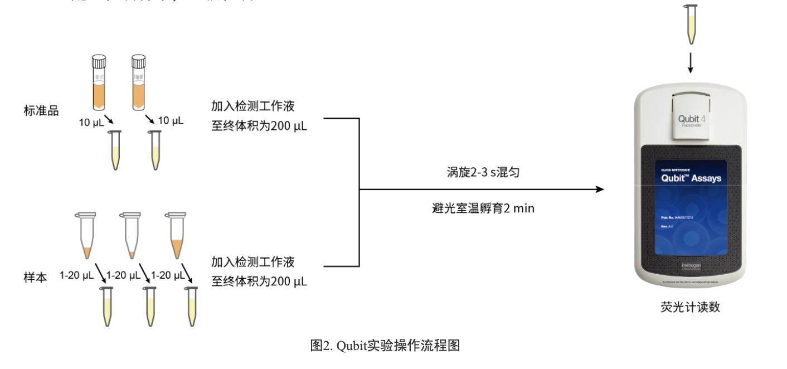

# How to check the quantity and quality of RNA

## I. RNA quantity

### 1. Nanodrop

* 原理：核酸及其衍生物具有共轭双键系统，能吸收紫光，RNA和DNA的紫外吸收峰在260nm波长处。一般在260nm波长下，每1ml含1ug RNA溶液的光吸收值为0.022～0.024，DNA为0.020，故测定位置浓度的RNA或DNA溶液在260nm处的光吸收值，即可计算出其中核酸的含量。
* 优点：除检测核酸浓度外，还能通过计算A260/A280和A260/A230的数值，估计核酸的纯度（280 nm吸光通常来自蛋白质，而230 nm则通常来自糖类和苯酚等）。
* 缺点：**无法区分RNA、DNA、降解或游离的核酸及其他杂质。**
* 局限性：尽管是常用的DNA/RNA定量方法，但其**读数并不可靠且不准确**，不能用于后续建库的参考。**且紫外吸收法对降解比较严重的核酸无能为力。**
* 测量范围：RNA浓度约为100 ng/ul时，SD为2ng/ul。

### 2. Qubit

* 原理：采用荧光染料检测特定目标分子的浓度，**molecular probes染料只有与DNA、RNA、或蛋白质这些特定靶分子结合，并在特定波长光源的激发下，发出荧光信号，即使有游离或降解的核苷酸存在时仍能克服背景噪音，精准定量。**
* 优点：高灵敏性、高特异性、高精确度，**在样本浓度低的情况下，Qubit更为准确。**
* 适用性：Qubit定量技术对目标分子有高度的选择性，比如：Qubit检测双链DNA浓度时，特异性检测待测样本中的的双链DNA，对于样本中存在的单链DNA或者RNA不检测，这种特异性可以获得十分精确的结果。在新一代测序（NGS）实验中，对我们后续的精确建库过程也是很必要的。
* 局限性：Qubit检测仅样品中DNA/RNA的量，不能获取吸光度读数以提供A260/A280比率或检测核酸样品中的蛋白质。
* 操作方法（如下图）:

1\) 配置标准品并测量，仪器自动校正并生成标准曲线；

2\) 配置检测样本，上机检测。

### 3. Nanodrop vs Qubit优劣比较

### 4. Read more

[核酸定量哪家强？](https://github.com/lulab/intranet/blob/master/wetlab_protocol/basic/quantify.md)

## II. RNA quality

* 评估RNA完整性是获得有意义基因表达数据的第一个关键步骤。采用完整的RNA是成功建立NGS文库或进行qRT-PCR实验的关键要素
* **RNA Integrity Number，RIN值，**旨在标准化RNA质量控制过程，基于1至10的编号统，RIN软件算法可将真核生物总RNA分类，其中1代表降解最严重的情况，10代表最完整。

### 1. 紫外吸光度检测法

检测RNA溶液的吸光度280/320/230/260nm下的吸光度分别代表了核酸、背景/溶液浑浊度、盐浓度和蛋白质等有机物的值。

可以通过看OD260/OD280的值R，1.8-2.0时，我们认为RNA中蛋白质或其他有机物的污染时可容忍的；当R2.2时，说明RNA已经水解成单核酸了。

### 2. RNA凝胶电泳法

核糖体RNA则占总RNA样品80%以上，其中大多数是由28S和18S rRNA组成的（在哺乳动物系统中），哺乳动物28S和18S rRNA的长度大约分别为5kb和2kb，所以理论上28S:18S的比率应该大约为2.7:1。

通过琼脂糖胶检测28S和28S条带的完整性和比值，如果28S和18S条带明亮、清晰、条带边缘清楚，并且28S的亮度在18S条带的两倍以上，我们认为RNA的质量较好。

但是因为rRNA条带的外观会受电泳条件、RNA上样量以及溴化乙锭荧光饱和度等条件的影响，准确性和稳定性低。

此外，使用变性凝胶电泳来评估RNA完整性的一个缺陷是需要至少200ng的RNA样品；但很多RNA样本浓度较低，该方法就不再适用。

### 3. Agilent 2100 Bioanalyzer（升级版为A2200）

* A2100检测是基于芯片实验室技术的核酸分析系统，对RNA或DNA文库进行定量及定性的新一代质控方法。
* 原理：通过微流控技术对样本进行分离，当给芯片加入电压时，样品便在芯片上的显微蚀刻管道中进行毛细管电泳；在样品流动过程中，不同核酸片段根据大小被分离；凝胶-染料基质中的荧光染料可嵌入核酸，通过激光激发荧光，使其被仪器检测到。
* 定量：仪器根据收集到的荧光信号强度，并通过ladder各个条带（已知size和浓度）及其相对应的迁移时间，形成一个迁移时间和浓度的函数关系，并计算未知input核酸的浓度，对样品定量
* 定性（完整性）：提供总RNA、mRNA和小分子RNA数据，以及RNA完整度（RIN）。
* 样本体积：1ul RNA溶液。
* 优点：**高度准确、数字化结果、快速高效、操作简便、耗样量少。**
* 操作步骤： 1）样品自样品孔处沿微通道移动； 2）样品被注入分离微通道； 3）样品组分通过电泳被分离； 4）各组分通过其荧光被检测并被转变成凝胶样图像（条带）和电泳图谱（峰）。
* 适用性：Agilent 2100生物分析仪是一种可以对组成总RNA的主要组分进行更清晰评估的工具，还可以对它们随来源、时间及保存方式产生的变化进行评估。**已经取代了繁琐的凝胶电泳技术成为RNA样品质量控制\(QC\)的行业标准。**

### 4. Read more

* [Agilent 2100生物分析仪](https://www.agilent.com/cs/library/brochures/5989-7725CHCN_low.pdf)
* [RNA完整值--RNA质量控制标准化](https://www.agilent.com/cs/library/applications/5989-1165CHCN.pdf)

